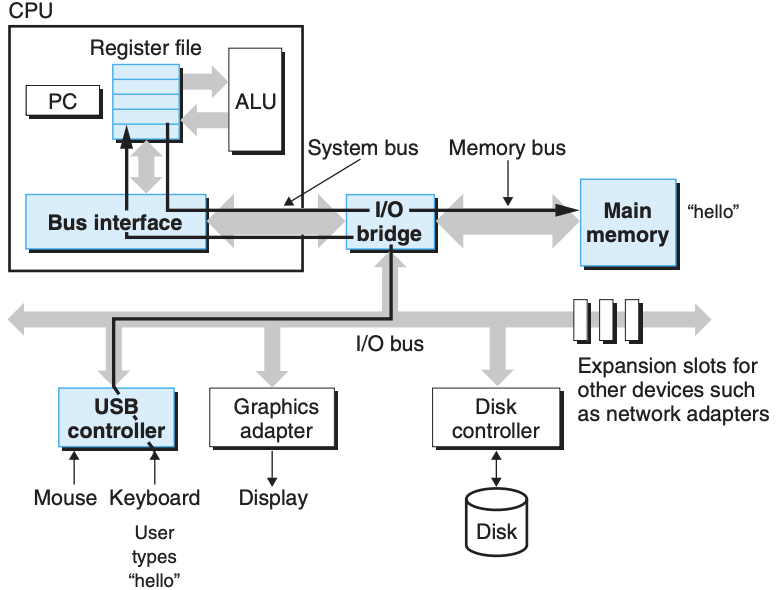
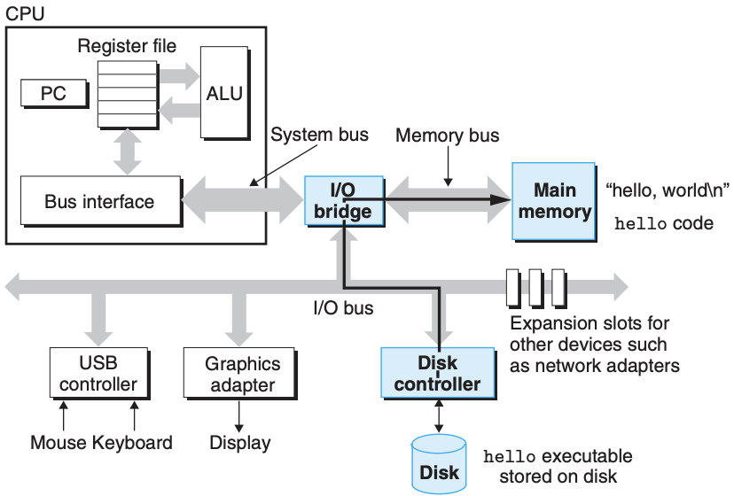
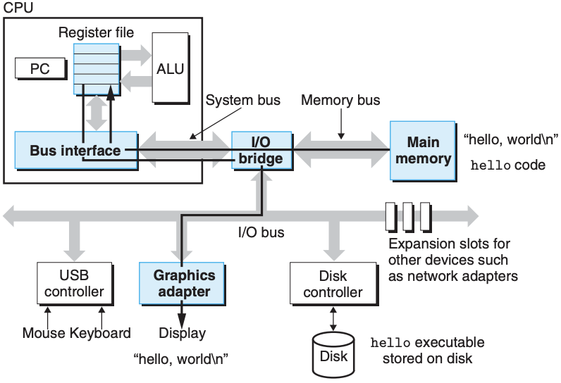
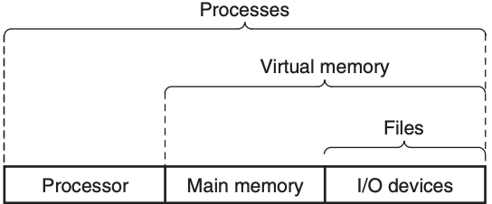
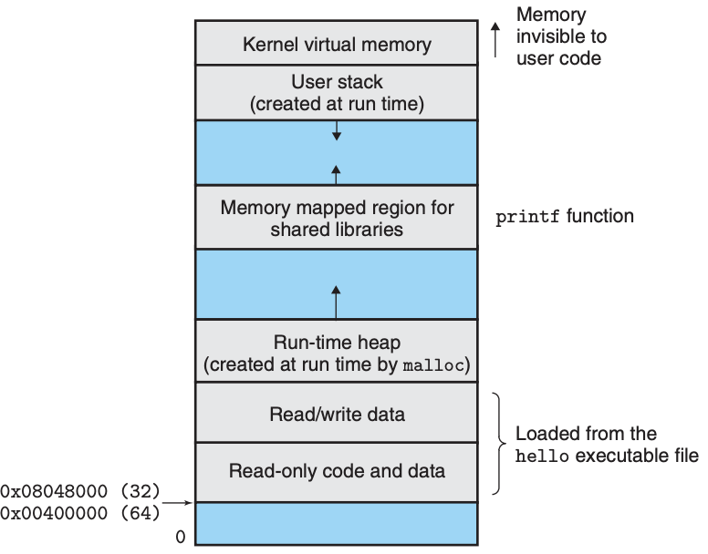
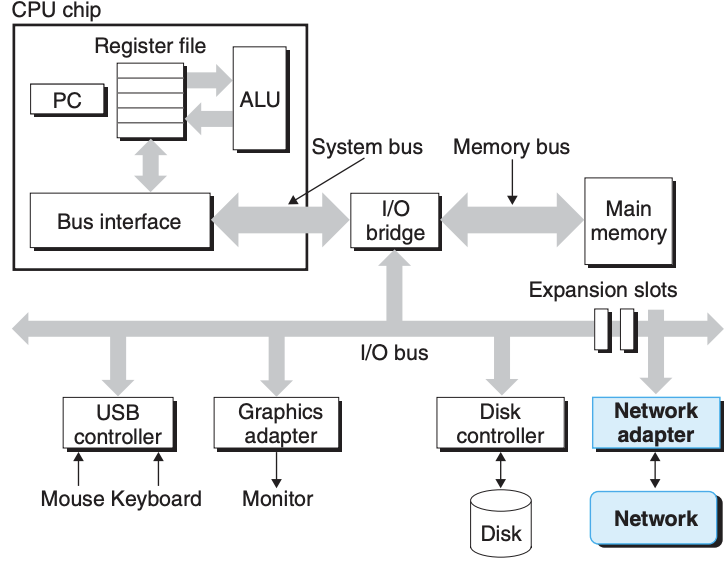

# 컴퓨터 시스템 훑어보기

> 간단한 "hello, world" 프로그램의 일생 주기를 추적해서 컴퓨터 시스템에서의 주요 아이디어와 주제들을 소개한다.

### 1. hello 프로그램

시스템에 관한 공부의 시작은 아래 hello 프로그램이 프로그래머에 의해 만들어지고, 시스템에서 실행되고, 단순한 메시지를 출력하고, 종료될 때까지의 수명주기를 추적하는 것으로 시작한다. 프로그램의 수명주기를 따라가면서 주요 개념과 용어, 그리고 관련된 구성요소를 간략히 알아보겠다.

```c++
#include <stdio.h>

int main()
{
    printf("hello, world\n");
    return 0;
}
```

위 hello 프로그램은 프로그래머가 에디터로 작성한 소스 프로그램(파일)로 생명을 시작하여, hello.c라는 텍스트 파일로 저장된다. 소스 파일은 0 또는 1로 표시되는 **비트**들의 연속이며, **바이트**라는 **8비트 단위**로 구성된다. 각 바이트는 소스 파일의 텍스트 문자를 나타낸다. 

대부분 컴퓨터 시스템은 텍스트 문자를 아스키(ASCII) 표준을 사용하여 표시한다. 각 바이트는 특정 문자에 대응되는 정수 값을 가진다. 예를 들어 첫 번째 문자 '#'은 아스키 값 35가 된다. 이렇게 아스키 문자들로만 이루어진 파일을 **텍스트 파일**이라고 부른다. 다른 모든 파일들은 **바이너리 파일**이라고 한다.

위 방법처럼 모든 시스템 내부의 정보(디스크 파일, 메모리상의 프로그램, 데이터, 네트워크를 통해 전송되는 데이터)는 비트들로 표시된다. 서로 다른 객체들을 구분하는 유일한 방법은 이들을 바라보는 **컨텍스트**에 의해서다. 다른 컨텍스트에서는 동일한 일련의 바이트가 정수, 부동소수, 문자열 또는 기계어 명령을 의미할 수 있다.

---

### 2. 컴파일 시스템

hello.c를 시스템에서 실행시키려면, 각 C 문장들은 다른 프로그램들에 의해 저급 *기계어*  명령어들로 번역되어야 한다. 이 명령어들은 **실행 가능 목적** 프로그램(파일)이라고 하는 형태로 합쳐져서 바이너리 디스크 파일로 저장된다. **컴파일러 드라이버**는 소스 파일 hello.c를 잃어서 실행파일인 hello로 번역한다. 4개의 단계를 거쳐서 실행되며, 이 네 단계를 실행하는 프로그램을 **컴파일 시스템**이라고 부른다.


- 전처리 단계: **전처리기(Pre-processor)**는 '#'문자로 시작하는 디렉티브에 따라 수정한다. 예를 들어 "#include <stdio.h>"는 전처리기에게 시스템 헤더파일인 stdio.h를 직접 삽입하라고 지시한다. 그 결과 일반적으로 .i로 끝나는 새로운 텍스트 파일 hello.i가 생성된다.
- 컴파일 단계: 컴파일러는 텍스트 파일 hello.i를 텍스트 파일 hello.s로 번역하며, 이 파일에는 **어셈블리어 프로그램**이 저장된다.
- 어셈블리 단계: 어셈블러가 hello.s를 기계어 명령어로 번역하고, 이들을 **재배치 가능 목적 프로그램**의 형태로 묶어서 hello.o라는 목적 파일에 그 결과를 저장한다. 이 파일은 바이너리 파일이므로 텍스트 편집기로 열어보면 쓰레기 같은 데이터로 보인다.
- 링크 단계: hello 프로그램은 C 컴파일러에서 제공하는 표준 C 라이브러이에 들어있는 printf 함수를 호출한다. printf 함수는 이미 컴파일된 별도의 목적 파일인 printf.o에 들어 있으며, 이 파일은 hello.o 파일과 어떻게든 결합되어야 한다. 링커 프로그램이 이 통합작업을 수행한다. 그 결과 hello 파일은 **실행 가능 목적 파일**(즉, 실행 파일)로 메모리에 적재되어 시스템에 의해 실행된다.

지금까지 hello.c 소스 파일은 컴파일 시스템에 의해 hello라는 실행 가능한 목적 파일로 번역되어 디스크에 저장되었다.

---

### 3. 시스템의 하드웨어 조직

hello 프로그램을 실행할 때 무슨 일이 일어나는지 설명하기 위해서는 전형적인 시스템에서의 하드웨어 조직을 이해할 필요가 있다.


#### - 버스

시스템 내를 관통하는 전기적 배선군을 **버스**라고 한다. 버스는 컴포넌트들 간에 바이트 정보들을 전송한다. 일반적으로 **워드(word)**라고 하는 고정 크기의 바이트 단위로 데이터를 전송하도록 설계된다. 한 개의 워드를 구성하는 바이트 수는 시스템마다 보유하는 기본 시스템 변수다. 오늘날 대분분의 컴퓨터들은 4바이트(32비트) 또는 8바이트(64비트) 워드 크기를 갖는다.

#### - 입출력 장치

**입출력 장치**는 시스템과 외부세계와의 연결을 담당한다. 위 그림에 나와있는 시스템은 네 개의 입출력 장치를 가지고 있다: 입령용 키보드와 마우스, 출력용 디스플레이, 데이터와 프로그램의 장기 저장을 위한 디스크 드라이브, 처음에 실행 가능 파일인 hello 프로그램은 디스크에 저장되어 있다. 각 입출력 장치는 입출력 버스와 **컨트롤러**나 **어댑터**를 통해 연결된다. 컨트롤러는 디바이스 자체가 칩셋이거나 시스템의 메인보드에 장착된다. 어댑터는 메인보드 슬롯에 장착되는 카드다. 이들 각각의 목적은 입출력 버스와 입출력 장치들 간에 정보를 주고받도록 해주는 일이다.

#### - 메인 메모리

**메인 메모리**는 프로세서가 프로그램을 실행하는 동안 데이터와 프로그램을 모두 저장하는 임시 저장장치다. 물리적으로 메인 메모리는 **DRAM(Dynamic Random Access Memory)** 칩들로 구성되어 있다. 논리적으로 메모리는 연속적인 바이트들의 배열로, 각각 0부터 시작해서 고유의 주소(배열의 인덱스)를 가지고 있다. 일반적으로 한 개의 프로그램을 구성하는 각 기계어 명령어는 다양한 바이트 크기를 갖는다.

#### - 프로세서

**중앙 처리 장치(CPU)** 또는 간단히 **프로세서**는 메인 메모리에 저장된 기계어들을 해독(실행)하는 엔진이다. 프로세서의 중심에는 워드 크기의 저장장치(또는 **레지스터**)인 **프로그램 카운터(PC)**가 있다. 어느 순간 PC는 메인 메모리의 기계어 명령어를 가리킨다.

시스템에 전원이 공급되는 순간부터 전원이 끊어질 때까지 프로세서는 PC가 가리키는 곳의 명령어를 반복적으로 실행하고 PC값이 다음 명령어의 위치를 가리키도록 업데이트한다. 명령어들은 규칙적인 순서로 실행되고, 한 개의 명령을 실행하는 것은 여러 단계를 수행함으로써 이루어진다. 프로세서는 PC가 가리키는 메모리로부터 명령어를 잃어오고, 이 명령어에서 비트들을 해석하여 명령어가 지정하는 간단한 동작을 실행하고, PC를 다음 명령어 위치로 업데이트한다. 이 새로운 위치는 방금 수행한 명령어와 메모리 상에서 연속적일 수 있고, 그렇지 않을 수도 있다.

위와 같이 몇 개의 단순한 동작만이 있을 뿐이며, 이들은 메인 메모리, 레지스터 파일, 수식/논리 처리기(ALU) 주위를 순환한다. **레지스터 파일**은 각각 고유의 이름을 갖는 워드 크기의 레지스터 집합으로 구성되어 있다. **ALU**는 새 데이터와 주소값을 계산한다. 다음은 명령어의 요청에 의해 CPU가 실행하는 단순한 작업의 예이다.

- 적재(Load): 메인 메모리에서 레지스터에 한 바이트 또는 워드를 이전 값에 덮어쓰는 방식으로 복사한다.
- 저장(Store): 레지스터에서 메인 메모리로 한 바이트 또는 워드를 이전 값을 덮어쓰는 방식으로 복사한다.
- 작업(Operate): 두 레지스터의 값을 ALU로 복사하고 두 개의 워드로 수식연산을 수행한 뒤, 결과를 덮어쓰는 방식으로 레지스터에 저장한다.
- 점프(Jump): 명령어 자신으로부터 한 개의 워드를 추출하고, 이것을 PC에 덮어쓰는 방식으로 복사한다.

---

### 4. hello 프로그램의 실행

처음에 리눅스 쉘 프로그램은 자신의 명령어를 실행하면서 사용자가 명령을 입력하기를 기다린다.

```shell
linux> ./hello
```

"./hello"를 입력하면 각각의 문자를 레지스터에 읽어 들인 후, 아래 그림과 같이 메모리에 저장한다.



키보드에서 엔터를 누르면 쉘은 명령 입력을 끝마쳤다는 것을 알게 된다. 그러면 쉘은 명령 입력을 끝마쳤다는 것을 알게 된다. 그러면 아래 그림처럼 쉘은 파일 내의 코드와 데이터를 복사하는 일련의 명령어를 실행하여 실행파일 hello를 디스크에서 메인 메모리로 로딩한다. 데이터 부분은 최종적으로 출력되는 문자 스트링인 "hello, world\n"을 포함한다. **직접 메모리 접근(DMA)**이라고 알려진 기법을 이용해서 데이터는 프로세서를 거치지 않고 디스크에서 메인 메모리로 직접 이동한다.



일단 hello 목적 파일의 코드와 데이터가 메모리에 적재된 후, 아래 그림과 같이 프로세서는 hello 프로그램의 main 루틴의 기계어 명령어를 실행하기 시작한다. 이 명령어들은 "hello, world\n" 문자열을 메모리로부터 레지스터 파일로 복사하고, 거기로부터 디스플레이 장치로 전송하여 화면에 글자들이 표시된다.



---

### 5. 캐시

위 내용으로부터 알게 된 것은 시스템이 정보를 한 곳에서 다른 곳으로 이동시키는 일에 많은 시간을 보낸다는 것이다. hello 프로그램의 기계어 명령어들은 본래 하드디스크에 저장되어 있었다. 프로그램이 로딩될 때 이들은 메인 메모리로 복사된다. 프로세서가 프로그램을 실행할 때 명령어들은 메인 메모리에서 프로세서로 복사된다. 마찬가지로 "hello, world\n" 데이터 스트링도 본래는 디스크에 저장되어 있었지만, 메인 메모리로 복사되었다가 디스플레이 장치로 복사된다. 프로그래머의 관점에서 보면, 이러한 여러 복사과정들이 실제 작업을 느리게 하는 **오버헤드**다. 그래서 시스템 설계자들의 주요 목적은 이러한 복사과정들을 가능한 한 빠르게 동작하도록 하는 것이다.

일반적인 시스템 디스크 드라이브는 메인 메모리보다 1,000배 크기가 더 크지만, 프로세서가 디스크에서 1 워드의 데이터를 읽어들이는 데 걸리는 시간은 메모리에서보다 천만 배 더 오래 걸릴 수 있다. 마찬가지로 일반적인 레지스터 파일은 수백 바이트의 정보를 저장하는 반면, 메인 메모리의 경우는 십억 개의 바이트를 저장한다. 그러나 프로세서는 레지스터 파일의 데이터를 읽는 데 메모리보다 거의 100배 더 빨리 읽을 수 있다.

**캐시 메모리: 프로세서가 단기간에 필요할 가능성이 높은 정보를 임시로 저장하는 메모리**

프로세서-메모리 간 격차에 대응하기 위해 시스템 설계자는 보다 작고 빠른 **캐시 메모리(캐시)**라고 부르는 저장장치를 고안하여 프로세서가 단기간에 필요로 할 가능성이 높은 정보를 저장할 목적으로 사용한다. 아래 그림은 일반적인 시스템에서의 캐시 메모리를 보여준다.

프로세서 칩 내에 들어있는 **L1 캐시**는 대략 수천 바이트의 데이터를 저장할 수 있으며, 거의 레지스터 파일만큼 빠른 속도로 엑세스 할 수 있다. 이보더 좀 더 큰 **L2 캐시**는 수백 킬로바이트에서 수 메가 바이트의 용량을 가지며 프로세서와 전용 버스를 통해 연결된다. L1, L2 캐시는 **SRAM(Static Random Access Memory)**이라는 하드웨어 기술을 이용해 구현한다.

위 내용의 가장 중요한 교훈 중 하나는 캐시 메모리를 이해하는 응용 프로그래머는 캐시를 활용하여 자신의 프로그램 성능을 개선할 수 있다는 것이다.

---

### 6. 저장장치들의 계층구조

모든 컴퓨터 시스템의 저장장치들은 아래 그림과 같이 **메모리 계층구조**로 구성되어 있다. 계층의 꼭대기에서부터 맨 밑바닥까지 이동할수록 저장장치들은 더 느리고, 더 크고, 바이트당 가격이 싸진다.


메모리 계층구조의 주요 아이디어는 한 레벨의 저장장치가 다음 하위레벨 저장장치의 캐시 역할을 한다는 것이다. L1과 L2 캐시는 각각 L2와 L3의 캐시다. L3 캐시는 메인 메모리의 캐시이고, 메인 메모리는 디스크의 캐시 역할을 한다. 일부 분산 파일시스템을 가지는 네트워크 시스템에서 로컬 디스크는 다른 시스템의 디스크에 저장된 데이터의 캐시 역할을 수행한다.

프로그래머들이 성능을 개선하기 위해서 다른 종료의 캐시들을 활용할 수 있듯이 전체 메모리에 계층구조에 대한 지식을 활용할 수 있다.

---

### 7. 운영체제

> 운영체제: 시스템 하드웨어를 관리할 뿐 아니라 응용 소프트웨어를 실행하기 위하여 하드웨어 추상화 플랫폼과 공통 시스템 서비스를 제공하는 시스템 소프트웨어 -위키백과-

쉘 프로그램이 hello 프로그램을 로드하고 실행했을 때와 메시지를 출력할 때 프로그램은 키보드나 디스플레이, 디스크나 메인 메모리를 직접 엑세스하지 않고 **운영체제(Operation System)**가 제공하는 서비스를 활용한다. 운영체제는 아래 그림처럼 하드웨어와 소프트웨어 사이에 위치한 소프트웨어 계층으로 생각할 수 있다. 응용프로그램이 하드웨어를 제어하려면 언제나 운영체제를 통해서 해야 한다.


운영체제는 두 가지 주요 목적을 가지고 있다.

1. 제멋대로 동작하는 응용프로그램들이 하드웨어를 잘못 사용하는 것을 막는다.
2. 응용프로그램들이 단순하고 균일한 메커니즘을 사용하여 복잡하고 매우 다른 저수준 하드웨어 장치들을 조작할 수 있도록 한다.



운영체제는 이 두가지를 위 그림처럼 근본적인 추상화를 통해 달성하고 있다. **프로세스**, **가상메모리**, **파일**. 파일은 입출력장치의 추상화고, 가상메모리는 메인 메모리와 디스크 입출력 장치의 추상화, 그리고 프로세스는 프로세서, 메인 메모리, 입출력장치 모두의 추상화 결과다.

#### - 프로세스

> 프로세스는 컴퓨터에서 연속적으로 실행되고 있는 컴퓨터 프로그램을 말한다. -위키백과-

hello 같은 프로그램이 최신 시스템에서 실행될 때 운영체제는 시스템에서 이 한 개의 프로그램만 실행되는 것 같은 착각에 빠지도록 해준다. 한 프로그램이 프로세서, 메인 메모리, 입출력장치를 모두 독차지하고 있는 것처럼 보인다. 프로세서는 프로그램 내의 명령어들을 다른 방해 없이 순차적으로 실행하는 것처럼 보이고, 프로그램의 코드와 데이터가 시스템 메모리의 유일한 객체인 것처럼 보인다. 이러한 환상은 프로세스라고 하는 개념에 의해서 만들어진다.

**프로세스**는 실행 중인 프로그램에 대한 운영체제의 추상화다. 다수의 프로세스들은 동일한 시스템에서 동시에 실행될 수 있다. **동시에(concurrently)**라는 말은 한 프로세스의 명령어들이 다른 프로세스의 명령어와 섞인다는 것을 의미한다. 대부분 시스템에서 프로세스를 실행할 CPU의 숫자보다 더 많은 프로세스들이 존재한다. 이전에는 한 번에 한개의 프로그램만 실행할 수 있었지만, 요즘은 멀티코어 프로세서로 여러 개의 프로그램을 동시에 실행할 수 있다. 어느쪽이건 프로세서가 프로세스들을 바꿔주는 방식으로 한 개의 CPU가 다수의 프로세스를 동시에 실행하는 것처럼 보이게 해준다.

> **문맥 전환**(Context Switch)이란 하나의 프로세스가 CPU를 사용 중인 상태에서 다른 프로세스가 CPU를 사용하도록 하기 위해, 이전의 프로세스의 상태(문맥)를 보관하고 새로운 프로세스의 상태를 적재하는 작업을 말한다. 한 프로세스의 문맥은 그 프로세스의 프로세스 제어 블록에 기록되어 있다. -위키백과-

운영체제는 **문맥 전환**이라는 방법을 사용해서 이러한 교차실행을 수행한다. 여기서는 **단일 프로세서**시스템만 고려하겠다. 운영체제는 프로세스가 실행하는데 필요한 모든 상태정보의 변화를 추적한다. 이 **컨텍스트(context)**라고 부르는 상태정보는PC, 레지스터 파일, 메인 메모리의 현재 값을 포함하고 있다. 운영체제는 현재 프로세스에서 다른 프로세스로 제어를 옮기려고 할 때 현재 프로세스의 컨텍스트를 저장하고 새 프로세스의 컨텍스트를 복원시키는 **문맥 전환**을 실행하여 제어권을 새 프로세스로 넘겨준다. 새 프로세서는 이전에 중단했던 바로 그 위치부터 다시 실행된다.

 

위 그림의 예제01에는 두개의 동시성 프로세스가 존재한다.(쉘 프로세스와 hello 프로세스) 처음에는 쉘 프로세스가 혼자서 동작하고 있다가 명령줄에서 입력을 기다린다. hello 프로그램을 실행하라는 명령을 받으면, 쉘은 **시스템 콜**이라는 특수 함수를 호출하여 운영체제로 제어권을 넘겨준다. 운영체제는 쉘의 컨텍스트를 저장하고 새로운 hello 프로세스와 컨텍스트를 생성한 뒤 제어권을 새 hello 프로세스로 넘겨준다. hello 프로세스가 종료되면 쉘은 컨텍스트를 복구시키고 제어권을 넘겨주면서 다음 명령 줄 입력을 기다린다.

하나의 프로세스에서 다른 프로세스로의 전환은 운영체제 **커널(kernel)**에 의해 관리된다. 커널은 운영체제 코드의  일부분으로 메로리에 상주한다. 응용 프로그램이 운영체제에 어떤 작업을 요청하면, 컴퓨터는 파일 읽기나 쓰기와 같은 특정 **시스템 콜(system call)**을 실행해서 커널에 제어를 넘겨준다. 그러면 커널은 요청된 작업을 수행하고 응용프로그램으로 리턴한다. 커널은 별도의 프로세스가 아니라 모든 프로세스를 관리하기 위해 시스템이 이용하는 코드와 자료구조의 집합이다.

#### - 쓰레드

> **스레드**(thread)는 어떠한 프로그램 내에서, 특히 프로세스에서 실행되는 흐름의 단위를 말한다. 일반적으로 한 프로그램은 하나의 스레드를 가지고 있지만, 프로그램 환경에 따라 둘 이상의 스레드를 동시에 실행할 수 있다. 이러한 실행 방식을 멀티스레드(multithread)라고 한다. 

프로세스가 마치 한 개의 제어흐름을 갖는 것으로 생각할 수 있지만, 최근 시스템에서는 프로세스가 실제로 **쓰레드(Thread)**라고 하는 다수의 실행 유닛으로 구성되어 있다. 각각의 쓰레드는 해당 프로세스의 컨텍스트에서 실행되며 동일한 코드와 전역 데이터를 공유한다. 쓰레드는 다수의 프로세스보다 데이터의 공유가 더 쉽다는 점과 프로세스보다 더 효율적이기 때문에 프로그래밍 모델에서 중요성이 크다. 쓰레드에 관한 내용은 다음에 좀 더 알아보겠다.

#### - 가상메모리

**가상메모리**는 각 프로세스들이 메인 메모리 전체를 독점적으로 사용하고 있는 것 같은 환상을 제공하는 추상화다. 각 프로세스는 아래 그림처럼 **가상주소 공간**이라고 하는 균일한 메모리의 모습을 갖게된다.



리눅스에서, 주소곤강의 최상위 영역은 모든 프로세스들이 공통으로 사용하는 운영체제의 코드와 데이터를 위한 공간이다. 주소공간의 하위 여역은 사용자 프로세스의 코드와 데이터를 저장한다. (위 그림에서 위쪽으로 갈수록 주소가 증가한다.)

각 프로세스들에게 보여지는 가장주소 공간은 몇 개의 정의된 영역으로 구성되어 있다. 낮은 주소부터 위로 올라가면서 간단히 살펴보자.

- **프로그램 코드와 데이터** : 코드는 모든 프로세스들이 같은 고정 주소에서 시작하며, 다음에 C 전역변수에 대응되는 데이터 위치들이 따라온다. 코드와 데이터 영역은 실행 가능 목적 파일인 hello로부터 직접 초기화된다.
- **힙(Heap) **: 코드와 데이터 영역 다음으로 런타입 **힙**이 따라온다. 크기가 고정되어 있는 코드, 데이터 영역과 달리, 힙은 프로세스가 실행되면서 C 표준함수인 malloc이나 free를 호출하면서 런타에 동적으로 크기가 늘었다 줄었다 한다.
- **공유 라이브러리** : 주소공간의 중간 부근에 C 표준 라이브러리나 수학 라이브러리와 같은 공유 라이브러리와 같은 공유 라리브러리의 코드와 데이터를 저장하는 영역이 있다.
- **스택(Stack)** : 사용자 가상메모리 공간의 맨 위에 컴파일러가 함수 호출을 구현하기 위해 사용하는 사용자 **스택**이 위치한다. 힙과 마찬가지로 사용자 스택은 프로그램이 실행되는 동안에 동적으로 늘었다 줄어들었다 한다. 특히, 함수를 호출할 때마다 스택이 커지며, 함수에서 리턴될 때는 줄어든다.
- **커널 가상메모리** : 주소공간의 맨 윗부분은 커널을 위해 예약되어 있다. 응용프로그램들은 이 영역의 내용을 읽거나 쓰는 것이 금지되어 있으며, 마찬가지로 커널 코드 내에 정의도니 함수를 직접 호출되는 것도 금지되어 이다. 대신, 이런 작업을 수행하기 위해서는 커널을 호출해야 한다.

가상메모리가 작동하기 위해서는 프로세서가 만들어내는 모든 주소를 하드웨어로 번역하는 등의 하드웨어와 운영체제 소프트웨어 간의 복잡한 상호작용이 필요하다. 기본적인 아이디어는 프로세스의 가상메모리 내용을 디스크에 저장하고 메인 메모리를 디스크의 캐시로 사용하는 것이다.

#### - 파일

**파일**은 더도 덜도 말고 그저 연속된 바이트들이다. 디스크, 키보드, 디스플레이, 네트워크까지 포함하는 모든 입출력장치는 파일로 모델링한다. 시스템의 모든 입출력은 **유닉스 I/O**라는 시스템 콜들을 이용하여 파일을 읽고 쓰는 형태로 이루어진다. 이 파일 개념은 매우 강력해서 응용프로그램에 시스템에 들어있는 다양한 입출력장치들의 통일된 관점을 제공한다. 예를 들어 동일한 프로그램이 다른 디스크 기술을 사용하는 다른 시스템에서도 실행될 수 있다.

---

### 8. 네트워크 

시스템은 네트워크를 사용하여 다른 시스템과 통신한다. 이러한 관점에서 볼 때, 네트워크는 아래 그림처럼 단지 또 다른 입출력장치로 볼 수 있다.시스템이 메인 메모리로부터 네트워크 어댑ㅓ로 일련의 바이트를 복사할 때, 데이터는 로컬디스크 드라이브 대신에 네트워크를 통해서 다른 컴퓨터로 이동된다. 마찬가지로 시스템은 다른 컴퓨터로부터 받은 데이터를 읽어서 메인 메모리에 복사할 수 있다.



hello 예제로 돌아가서, telnet 응용을 사용하여 hello 프로그램을 다른 곳에 위치한 컴퓨터에서 실행할 수 있다. 다음은 telnet 클라이언트를 사용하여 로컬 컴퓨터를 원격 컴퓨터의 telnet 서버와 연결한 후, 네트워크를 거쳐 "hello, word\n" 문자열을 출력하기 까지의 과정을 보여준다.


위 그림처럼 이러한 유형의 클라이언트와 서버 간의 데이터 교환은 모든 네트워크 응용의 전형적인 사례이다.

---

### 요약

컴퓨터 시스템은 응용프로그램을 실행하기 위해 함께 동작하는 하드웨어와 시스템 소프트웨어로 구성된다. 컴퓨터 내의 정보는 상황에 따라 다르게 해석되는 비트들의 그룹으로 표시된다. 프로그램은 ASCII 문자로 시작해서 컴파일러와 링커에 의해 바이너리 실행파일들로 번역되는 방식으로, 다른 프로그램들에 의해 다른 형태로 번역된다.

프로세서는 메인 메모리에 저장된 바이너리 인스트럭션을 읽고 해석한다. 컴퓨터가 대부분 시간을 메모리, 입출력장치, CPU 레지스터 간에 데이터를 복사하는 데 쓰고 있으므로 시스템의 저장장치들은 계층구조를 형성하여 최상위 부터 CPU 레지스터, 하드웨어 캐시 메모리, DRAM 메인 메모리, 디스크 저장장치 등이 순차적으로 위치한다. 계층 구조가의 상부일 수록 비트당 단가가 더 비싸고, 더 빠르다.

계층구조 상부의 저장장치들은 하부의 장치들을 위한 캐시 역할을 수행한다. 프로그래머들은 이러한 메모리 계층구조를 이해하고 활용해서 자신이 작성한 C 프로그램의 성능을 최적화할 수 있다.

운영체제 커널은 응용프로그램과 하드웨어 사이에서 중간자의 역할을 수행한다. 운영체제는 세 가지 근본적인 추상화를 제공한다. (1) 파일을 입출력장치의 추상화, (2) 가상메모리는 메인 메모리와 디스크의 추상화, (3) 프로세스는 프로세서, 메인 메모리, 입출력 장치의 추상화다.

마지막으로 네트워크는 컴퓨터 시스템이 서로 통신할 수 있는 방법을 제공한다. 특정 시스템의 관점으로 볼 때, 네트워크는 단지 또 하나의 입출력장치다.

---