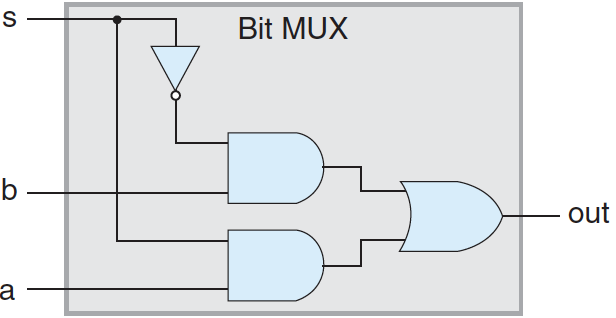
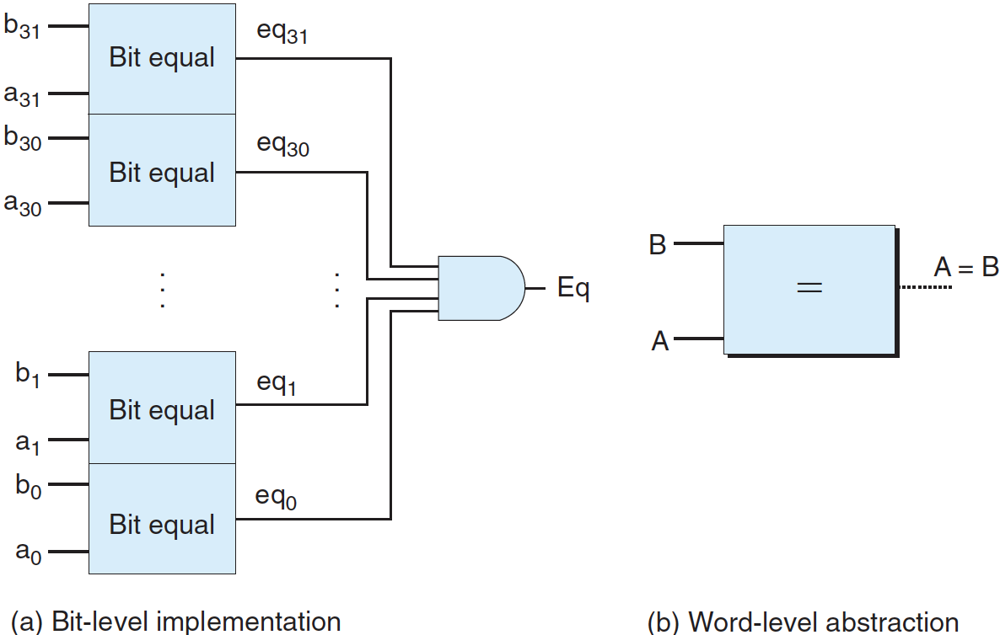

# 논리 설계와 HCL

하드웨어를 설계할 때 전자회로를 사용해서 비트들의 함수를 계산하고 여러 가지 메모리 원소들에 비트들을 저장한다. 현재는 보통 전압으로 비트 값을 타나내며, 논리값 1은 약 1.0볼트로 나타내고 논리값 0은 0.0볼트 부근의 값을 나타낸다.

디지털 시스템을 만들기 위해서는 다음과 같이 세 개의 주요 컴포넌트가 있어야 한다:

- 비트 연산을 위한 **조합 회로**
- 비트를 저장하는 **메모리 소자**
- 메모리 소자의 갱신을 조절하는 **클럭 신호**

HCL(hardware control language)은 프로세서 설계에서 제어회로를 기술하는데 사용하는 C언어와 유사한 문법을 가진 언어다.

---

## 1. 논리 게이트

논리 게이트는 디지털 신호에서 기초 연산 소자다. 이들은 입력 비트 값들에 대해 불 함수같은 출력을 만들어 낸다.


위 그림은 불 함수 AND, OR, NOT으로 사용되는 표준 심볼이다. HCL에서 연산자는 아래와 같다:

- AND : `&&`
- OR : `||`
- NOT : `!`

여기서 비트수준 C 연산자 &, |, ~ 대신에 이들을 사용하는 이유는 논리 게이트들이 워드 전체가 아니라 단일 비트에 대해 연산하기 때문이다.

논리 게이트들은 항상 동작한다. 만약 게이트로 들어가는 일부 입력이 바뀐다면 시간이 약간 지난 후에 출력값이 바뀐다.

---

## 2. 조합회로와 HCL 불 수식

**조합회로**는 여러 가지 논리 게이트를 모아서 만든 네트워크다. 어떻게 조합회로가 구성되는지와 관련해서 몇 가지 제한이 있다:

- 모든 논리 게이트 입력은 정확히 다음 중 하나에 연결되어야 한다:
  - (1) 시스템 입력중의 하나
  - (2) 일부 메모리 소자의 출력 
  - (3) 일부 논리 게이트의 출력
- 두 개 이상의 논리 게이트의 출력은 서로 연결될 수 없다. 그렇지 않으면 이 두 출력은 전선을 다른 전압으로 구동하려 할 수 있으며, 잘못된 전압이나 회로 오동작을 야기할 수 있다.
- 조합회로에는 **순환회로**가 없어야 한다. 조합회로 내에 여러 게이트를 통해서 루프를 형성하는 경로가 존재한다면, 계산하는 기능에 모호성이 생길 수 있다.

#### - 비트 동일성을 시험하기 위한 조합회로


위 그림은 **두 개의 입력 a, b가 모두 1이거나 0이면 1을 출력**하는 간단한 조합회로다. 이 조합회로의 기능을 HCL로 다음과 같이 기술한다:

```cpp
bool eq = (a && b) || (!a && !b);
```

#### - 1비트 멀티플렉서 회로




위 그림은 **제어신호 s가 1이면 출력은 s가 되고, s가 0이면 입력 b가 출력**하는 1비트 멀티플렉서 회로다. 멀티플렉서는 제어 입력 신호 값에 따라 여러 데이터 신호 중에서 한 값을 선택한다. 이 회로는 두 AND 게이트가 이들의 데이터 입력을 OR 게이트로 보낼지를 결정한다. HCL로 나타내면 다음과 같다:

```
bool out = (s && a) || (!s && b);
```

---

## 3. 워드수준 조합회로

논리 게이트들의 커다란 네트워크를 연결해서 보다 복잡한 함수를 계산하는 조합회로를 구성할 수 있다. 보통 데이터 **워드**를 가지고 동작하는 회로를 설계하게 된다.

워드수준 계산을 수행하기 위한 조합회로들은 입력 워드의 각 비트들에 따라 출력워드의 각 비트를 계산하는 논리회로를 사용해서 구성된다.

#### - 워드수준 동일성 시험 회로



위 그림은 **두 64비트 워드 A, B가 같은지 시험**하는 조합회로다. 즉, A의 각 비트가 대응하는 B의 비트들과 모두 같을 때만 출력이 1이된다. 단순성을 위해 HCL에서는 워드 크기를 명시하지 않고 모든 워드수준 신호를 int로 선언한다. 워드수준 수식으로 기술하면 다음과 같다:

```
bool Eq = (A == B);
```

#### - 워드수준 멀티플레서 회로


위 회로는 제어입력 비트 s에 따라서 두 입력 워드 A또는 B 중에서 하나와 같은 64비트 워드 Out을 출력한다. (s가 1이면 결과는 입력 워드 A와 같고, 그렇지 않으면 B와 같다.) 프로세스 설계에서 여러 가지 형태의 멀티플렉서를 사용한다. 이들을 사용해서 제어 조건에 따라 여러 입력 소스로부터 특정 워드를 선택할 수 있게 된다. 멀티플렉서는 HCL에서 case 식을 사용해서 기술된다.

```
[
    select_1 : expr_1;
    select_2 : expr_2;
    .
    .
    .
    select_i : expr_i
]
```

논리적으로 선택 수식들은 순차적으로 계산되며, 첫 번째 1을 만드는 case가 선택된다. 예를 들어 위 그림의 워드수준 멀티플렉서는 HCL로 다음과 같다:

```
word Out = [
    s: A;
    1: B;
];
```

위 코드에서 두 번째 선택 수식은 단순히 1이며, 만일 이전에 하나도 선택되지 않았다면 이 case가 선택되어야 한다. 이것이 HCL에서 default case를 명시하는 방법이다.

#### - 4입력 멀티플렉서

실제 하드웨어 멀티플렉는 위 그림의 s와 !s 처럼 어떤 입력 워드가 출력으로 나갈지를 제어하는 베타적인 신호를 가져야 한다. 선택 수식들은 임의의 불 수식으로 나타낼 수 있으며, 임의의 개수의 case가 존재할 수 있으므로 입력 신호를 복잡한 석택 기준에 의해 여러 가지 방식으로 선택할 수 있는 블록을 설명하는 case 수식이 가능하다. 


위 그림은 **제어신호 s1과 s2의 여러 가지 조합에 의해 어떤 데이터 입력이 출력에 전송될지 결정**할 수 있는 4입력 멀티플렉서다. 이 회로는 네 입력 워드 A, B, C, D 중에서 제어신호 s1, s0의 2비트 이진수 값에 의해 선택한다.

```
word Out4 = [
    !s1 && !s0 : A; # 00
    !s1		   : B; # 01
    !s0		   : C; # 10
    1		   : D; # 11
]
```

---

## 3. 메모리와 클럭

조합회로들은 근복적으로 정보를 저장하지 않는다. 그 대신, 이들은 단순히 입력 신호들에 반응하여 그 입력을 갖는 함수와 같은 출력을 만들어 낸다. 그래서 상태를 가지며 이 상태에 대해 계산을 하는 회로를 만들기 위해서는 비트로 표시된 정보를 저장하는 장치를 이용해야 한다. 저장장치들은 로딩되는 때를 결정하는 주기적 신호인 한 개의 **클럭**에 의해 새 값들이 모두 제어된다.

- **클럭**을 사용하는 **레지스터**들 : 워드나 개별 비트를 저장한다. 클럭 신호는 레지스터의 입력 값을 적재하는 것을 제어한다.
- **랜덤-접근 메모리** : 어떤 워드를 읽거나 쓰기 위해 주소를 사용해서 여러 워드를 저장한다.

"레지스터"라는 단어는 하드웨어와 기계어 프로그램에서 사용할 때 약간 다른 것을 의미한다.

- 하드웨어에서의 레지스터 : 입력과 출력 전선들로 회로의 나머지 부분과 직접 연결
- 기계어 프로그램에서의 레지스터 : 주소가 레지스터의 ID인 CPU 내의 주소지정이 가능한 워드들의 작은 집합


위 그림은 하드웨어 레지스터의 모습과 어떻게 동작하는지 보여준다. 일반적으로 레지스터는 어떤 고정된 상태(*x*)로 남는데, 자신의 현재 상태와 같은 출력을 낸다 레지스터의 출력은 클럭이 low로 남아 있는 한 고정된 채로 남아 있다. 클럭이 올라가면 입력 신호들이 다음 상태(*y*)로 레지스터에 로딩되고, 이것이 다음 high 클럭 에지(edge)까지 새로운 레지스터의 출력이 된다. 중요한 점은 레지스터들은 매 클럭의 high 에지에서만 레지스터 입력에서 출력으로 전달된다. 


위 그림은 전형적인 레지스터 파일을 보여준다.

