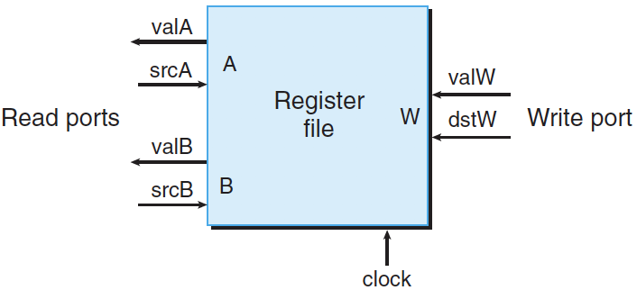

# 메모리와 클럭

조합회로들은 근복적으로 정보를 저장하지 않는다. 그 대신, 이들은 단순히 입력 신호들에 반응하여 그 입력을 갖는 함수와 같은 출력을 만들어 낸다. 그래서 상태를 가지며 이 상태에 대해 계산을 하는 회로를 만들기 위해서는 비트로 표시된 정보를 저장하는 장치를 이용해야 한다. 저장장치들은 로딩되는 때를 결정하는 주기적 신호인 한 개의 **클럭**에 의해 새 값들이 모두 제어된다.

- **클럭**을 사용하는 **레지스터**들 : 워드나 개별 비트를 저장한다. 클럭 신호는 레지스터의 입력 값을 적재하는 것을 제어한다.
- **랜덤-접근 메모리** : 어떤 워드를 읽거나 쓰기 위해 주소를 사용해서 여러 워드를 저장한다.

"레지스터"라는 단어는 하드웨어와 기계어 프로그램에서 사용할 때 약간 다른 것을 의미한다.

- 하드웨어에서의 레지스터 : 입력과 출력 전선들로 회로의 나머지 부분과 직접 연결
- 기계어 프로그램에서의 레지스터 : 주소가 레지스터의 ID인 CPU 내의 주소지정이 가능한 워드들의 작은 집합

위 그림은 하드웨어 레지스터의 모습과 어떻게 동작하는지 보여준다. 일반적으로 레지스터는 어떤 고정된 상태(*x*)로 남는데, 자신의 현재 상태와 같은 출력을 낸다 레지스터의 출력은 클럭이 low로 남아 있는 한 고정된 채로 남아 있다. 클럭이 올라가면 입력 신호들이 다음 상태(*y*)로 레지스터에 로딩되고, 이것이 다음 high 클럭 에지(edge)까지 새로운 레지스터의 출력이 된다. 중요한 점은 레지스터들은 매 클럭의 high 에지에서만 레지스터 입력에서 출력으로 전달된다. 

위 그림은 전형적인 레지스터 파일을 보여준다.