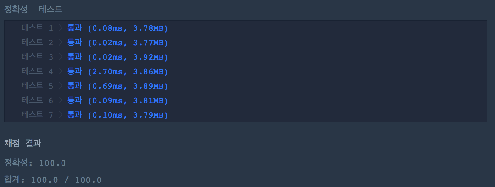

# N으로 표현

> 아래와 같이 5와 사칙연산만으로 12를 표현할 수 있습니다.
>
> 12 = 5 + 5 + (5 / 5) + (5 / 5)
> 12 = 55 / 5 + 5 / 5
> 12 = (55 + 5) / 5
>
> 5를 사용한 횟수는 각각 6,5,4 입니다. 그리고 이중 가장 작은 경우는 4입니다.
> 이처럼 숫자 N과 number가 주어질 때, N과 사칙연산만 사용해서 표현 할 수 있는 방법 중 N 사용횟수의 최솟값을 return 하도록 solution 함수를 작성하세요.

프로그래머스 알고리즘 1단계에서 꽤 어려운 문제인가보다. 이 문제를 푸는 시점에는 통과한 사람이 채 100명이 되지 않는다. 99번째로 통과했다.


---

## 완전 탐색, 무식하게 풀어보자. (+ 재귀)

'무식하게 푼다(brute-force)'라는 말은 가능한 경우의 수를 일일이 나열하면서 답을 찾는 방법을 의미한다. 이렇게 가능한 방법을 전부 만들어 보는 알고리즘들을 가리켜 흔히 '완전 탐색'이라고 부른다.

이 문제를 풀 수 있는 가장 쉬운 방법은 N, NN, NNN, ... , NNNNNNNN과 사칙 연산 +, - *, /를 이용한 경우의 수 중에 가장 N을 적게 사용한 경우를 return 하면 된다.

완전 탐색을 구현할 때 유용하게 사용되는 개념으로 '재귀 함수(recursive function)'가 있다. 재귀 함수란 자신이 수행할 작업을 유사한 형태의 여러 조각으로 쪼갠 두 그중 한 조각을 수행하고, 나머지를 자기 자신을 호출해 실행하는 함수를 말한다.

```cpp
#include <string>
#include <vector>
#include <cmath>

using namespace std;

vector<int> list;
int count = 0;
int minCount = 9;

// 완전 탐색 알고리즘 (Brute-Force Search)
void BFS(int N, int number)
{
    if(count >= minCount) return;
    if(list.size() >= minCount) return;
    int lastNumber = (list.size() == 0) ? 0 : list.back();
    
    if(lastNumber == number)
    {
        minCount = min(count, minCount);
        return;
    }
    
    int n = 0;
    int addCount = 0;
    
    for(int c = 1; c <= 10000000; c *= 10) 
    {
        addCount++;
        if(count + addCount >= minCount) continue;

        n += (N * c);
        
        count += addCount;
        
        list.push_back(lastNumber + n);
        BFS(N, number);
        list.pop_back();

        if(lastNumber - n != 0)
        {
            list.push_back(lastNumber - n);
            BFS(N, number);
            list.pop_back();
        }
           
        list.push_back(lastNumber * n);
        BFS(N, number);
        list.pop_back();

        if(lastNumber / n != 0)
        {
            list.push_back(lastNumber / n);
            BFS(N, number);
            list.pop_back(); 
        }
        
        count -= addCount;
    }
         
    return;
}

int solution(int N, int number) 
{    
    BFS(N, number);
    
    return minCount < 9 ? minCount : -1;
}
```

위 코드는 N부터 NNNNNNNNN까지 반복문을 돌며, 벡터에 +, -, * , / 연산의 결과값을 push, pop 하며 *BFS* 함수를 재귀 호출한다. 벡터의 마지막 값이 *number*이면 재귀를 끝낸다. 완전 탐색은 기본적으로 모든 경우의 수를 검사한다. 하지만 위 코드는 최소 사용횟수(`minCount`)를 비교하는 탈출 조건을 추가함으로써 연산량을 줄였다.

이 문제는 또 특이하게 효율성 검사를 하지 않는다. 위 코드의 결과는 아래와 같다.



---