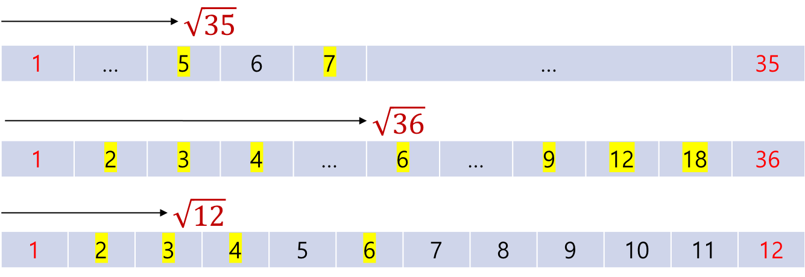
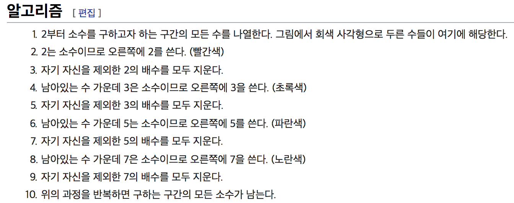

# 소수의 합

> 2부터 N까지의 모든 소수의 합을 구하세요.
> N이 7이라면 {2,3,5,7} = 17을 출력 하시면 됩니다.
> N의 범위는 2이상 10,000,000이하 입니다.
> 효율성 테스트의 모든 시간 제한은 1초입니다.

## Step 1. 소수의 정의와 소수 판별하기

소수란 1과 자기 자신으로밖에 나누어지지 않는 1 이외의 정수다. 예를 들어  { 2, 3, 5, 7, 11, 13….}과 같은 정수는 1 이외의 정수와 나누어지지 않는다. 위 문제에서 N은 양의 정수이므로 나누어 지지 않는다는 것은 나머지가 1 이상을 의미한다. 

대게 프로그래밍 언어는 사칙연산 이외에도 나머지 연산을 제공한다. 나머지 연산자의 결과값은 나누고 난 뒤의 나머지다.

```cpp
int a = 5 % 1; /* 0 */  int d = 5 % 4; /* 1 */

int b = 5 % 2; /* 1 */  int e = 5 % 5; /* 0 */

int c = 5 % 3; /* 2 */
```

소수인 양의 정수 5는 나눴을 때 1과 자기 자신 5를 제외하고는 나머지가 모두 1 이상이다. 즉 1과 n만을 약수로 가지므로 2부터 n-1까지의 수로는 나누어 지면 안 된다. 반대로 말하면 소수가 아닌 정수는 1과 자기 자신을 제외하고도 나머지가 0인 n이 있다는 것을 의미한다.

또한. 소수는 2를 제외하고 모두 홀수라는 규칙이 있다. 반복문을 이용해 구현하면 아래와 같다.

```cpp
bool IsPrimeNumber(int number)
{
    if (number == 2) return true;
    
    if (number == 1) return false;
    if (number % 2 == 0) return false; // 2를 제외한 소수는 항상 홀수
    
    // 소수는 홀수 이므로 짝수로 나누는 과정을 생략한다.
    for (int n = 3; n < number; n+=2)
    {
        if (number % n == 0) // 나누어지므로 소수가 아니다.
        {
            return false;
        }
    }
    
    return true;
}
```

---

## Step 2. N = A X B

어떤 수 n이 소수가 아닌 경우 n = a * b 관계이므로 n을 a나 b로 나눠 보면 된다. 아래 그림을 보면 a와 b 중 더 큰 수는 무조건 n의 제곱근의 값보다 크다. (더 작은 수는 n의 제곱근 이하의 값을 가진다.)

즉, 어떤 정수 n의 제곱근까지의 수 중 한 개의 수에 대해서라도 나누어떨어지면 소수가 아니다. 



위 규칙을 이용해서 *IsPrime* 함수의 반복문을 수정해보자.

```cpp
int rootNumber = sqrt(number);
for (int n = 3; n  <= rootNumber; n+=2)
{
    if (number % n == 0)
    {
        return false;
    }
}
```

알고리즘의 속도는 대게 반복문이 지배한다. 시간 복잡도가 n에서 sqrt(n)으로 향상되었다.

---

## Step 3. 캐시, 메모이제이션 : 소수 재사용

- 9 = { 1, 3, 9 }

- 15 = { 1, 3, 5, 15}
- 21 = { 1, 3, 7, 21}

- 25 = { 1, 5, 25 }

어떤 수 n이 소수가 아닌 경우 n보다 작은 소수로 나누어진다. 즉, n보다 작은 소수들로만 나누어 보면 된다.

```cpp
int rootNumber = sqrt(number);
for (int n = 3; n  <= rootNumber; n+=2)
{
    if (IsPrimeNumber(n) && (number % n == 0)) // 소수만 나누어 본다.
    {
        return false;
    }
}
```

하지만 위 방법은 나누는 수가 소수인지 매번 판별하므로 지금까지에 비해 매우 느리다.

판별된 소수를 재사용함으로써 속도의 향상을 꾀할 수 있다. 그러기 위해서는 소수를 메모리에 저장해 둘 필요가 있다. 이때 이미 계산된 값을 저장해 두는 메모리의 장소를 캐시(cache)라 하고. 캐시에 저장된 값을 재활용하는 기법을 메모이제이션(memoization)이라고 부른다.

```cpp
bool IsPrimeNumber(int number)
{
    static vector<int> primes {2, 3, 5, 7, 11, 13}; // 소수가 들어있는 벡터 (캐시)
    
    if (number == 2) return true;
    
    if (number == 1) return false;
    if (number % 2 == 0) return false;
    
    int rootNumber = sqrt(number);
    
    int i, n = 0;
    while (n <= rootNumber) // 벡터에 들어있는 소수들 중 n의 제곱근 보다 작은 소수와 먼저 나누어 본다.
    {                      // (메모이제이션)
        n = primes[i++];
        if(number % n == 0) return false;
    }
    
    for (; n  <= rootNumber; n+=2)
    {
        if (number % n == 0)
        {
            return false;
        }
    }
    
    primes.push_back(number); // 벡터(캐시)에 없는 새로운 소수 추가
    return true;
}

long long solution(int N) {
    long long answer = 2;
    
    for (int i = 3; i <= N; i+=2)
    {
        if(IsPrimeNumber(i) == true)
        {
            answer += i;
        }   
    }
        
    return answer;
}
```

Step 3의 알고리즘은 '소수 판별하기'가 아닌 '정수 N까지 소수의 합'에만 적용할 수 있는 알고리즘이다.

나는 여기 내용까지 직접 생각하고 구현해서 프로그래머스의 정확성과 효율성 테스트를 통과할 수 있었다. 제출 후 다른 사람들의 코드를 검토한 결과 '소수의 합'을 위한 좀 더 좋은 방법이 있다는 걸 알게 되었다.

---

## Step 4. 에라토네스의 체

> 고대 그리스의 수학자 에라토스테네스가 만들어 낸 소수를 찾는 방법. 이 방법은 마치 체로 치듯이 수를 걸러낸다고 하여 '에라토스테네스의 체'라고 부른다.




위 내용은 [위키백과: 에라토네스의 체](https://ko.wikipedia.org/wiki/%EC%97%90%EB%9D%BC%ED%86%A0%EC%8A%A4%ED%85%8C%EB%84%A4%EC%8A%A4%EC%9D%98_%EC%B2%B4)의 일부분이다.

한마디로 제일 작은 소수 2부터 시작하여 체에서 배수를 모두 거두는 방식이다.

```cpp
long long solution(int N) {
    long long answer = 0;
    vector<bool> sieve(N+1); // 에라토네스의 체 (default: false)
    
    for (int i = 2; i <= N; ++i)
    {
        if (sieve[i] == false)
        {
            answer += i;
        }
        
        for (int j = i; j <= N; j+=i) // 체에서 배수를 모두 거둔다.
        {
            sieve[j] = true; 
        }
    }
        
    return answer;
}
```

Step 3과 마찬가지로 Step 4의 아리토네스의 체 알고리즘은 '소수 판별하기'가 아닌 '정수 N까지 소수의 합'에 더 적합한 알고리즘이다.

---